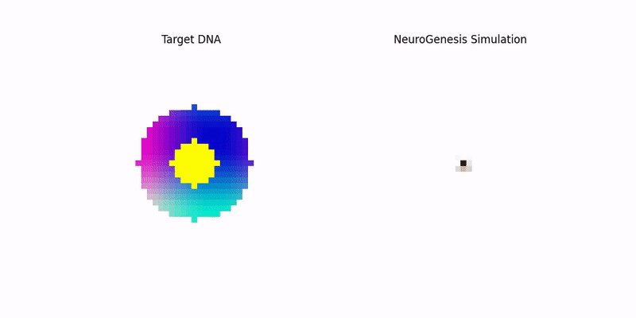

NeuroGenesis: Self-Repairing Biological Patterns
================================================

NeuroGenesis is a deep learning project that models complex biological processes, specifically **morphogenesis** and **regeneration**. Instead of using a conventional neural network for static classification or generation, this project implements a **Neural Cellular Automaton (NCA)**. In this system, a small, highly localized convolutional network acts as the "DNA," providing the update rule for every cell on the grid.

The result is a self-organizing system capable of growing a complex pattern from a single seed and autonomously restoring its structure after arbitrary damage.



🔬 The Core Mechanism: Neural Cellular Automaton (NCA)
------------------------------------------------------

The NCA operates on a discrete grid where each cell $(i, j)$ maintains a state vector $s_{i, j}$ consisting of $C=16$ channels (RGBA color + 12 hidden states). The system evolves iteratively based on the following local update rule:

$$\Delta s_{i, j} = \text{MLP}(\text{Perception}(s_{i, j})) \times M$$

-   $s_{i, j}$: The cell's state vector (16 values).

-   $\text{Perception}$: Implemented using **Sobel filters** across all channels. This allows the cell to effectively calculate local gradients, enabling it to "sense" boundaries and structure in its immediate $3\times3$ neighborhood.

-   $\text{MLP}$ **(Multi-Layer Perceptron)**: A tiny $1\times1$ convolutional network that acts as the cell's "brain," processing the perceived local information and outputting an update vector ($\Delta s$).

-   $M$ **(Stochastic Mask)**: A dropout mechanism (set by `CELL_FIRE_RATE` in the config) that ensures only a random subset of cells update at each time step. This asynchronous behavior is crucial for modeling biological robustness and coordination.

This training process forces the learned rule (the MLP weights) to create a **stable attractor state** corresponding to the target pattern, ensuring that the system naturally flows back to the intended form, even after massive disruption.

✨ Project Highlights
--------------------

1.  **True Self-Repair:** The model is continuously trained on grids that have been randomly damaged, learning a robust healing policy rather than just memorizing a static image.

2.  **Decentralized Coordination:** Pattern growth and regeneration are achieved without any global controller or central memory, relying entirely on local cell-to-cell communication.

3.  **Code Purity:** The entire project, including the NCA implementation, the training loop, the visualization engine, and the complex target image generation, is contained in a single file (`neuro_genesis_nca.py`) with minimal external dependencies.

🚀 Getting Started
------------------

The project is designed for simplicity and immediate execution.

### Prerequisites

You need Python (3.7+) and the following libraries:

```
pip install torch numpy matplotlib
```

### Execution

1.  Ensure the Python script (`neuro_genesis_nca.py`) is present.

2.  Run the script from your terminal:

```
python neuro_genesis_nca.py
```

### Demonstration Phases

The script will initiate a live, animated Matplotlib window showcasing the organism's lifecycle:

| Phase | Description | Steps |
| :--- | :--- | :--- |
| **I. Growth** | The pattern grows organically from a single, central seed pixel into the complex target artifact. | ~60 steps |
| **II. Trauma** | A significant, arbitrary portion of the pattern is instantly wiped out (e.g., the bottom half is erased). | 1 step |
| **III. Regeneration** | The surviving cells autonomously coordinate to rebuild the missing structure, restoring the original form. | ~60 steps |

📜 License
----------

This project, NeuroGenesis: Self-Repairing Biological Patterns, is available under the **MIT License**.
